# Sinair LLM Bot

An LLM-powered chat bot that lives in a sinair.net group chat as an ordinary member. It reads the
conversation, decides on its own when it has something worth saying, and replies in the persona of a
regular chat participant — witty, opinionated, broadly knowledgeable, and deliberately not spammy.

The project also ships a **data console**: a web dashboard (Google login) for operators to inspect
collected chat data, edit room summaries, and manage who has access.

## Using the bot in chat

The bot joins as a normal member (persona nick **`segfault`**). Here is what a chat user should know.

### When it replies
- It does **not** answer every message. A free heuristic filter drops obvious noise, a cheap LLM
  "gate" call judges ambiguous cases, and only then does it generate a reply.
- **Address it directly** by nick or an alias — `segfault`, `сега`, `сегвульт` (whole-word; `@nick`
  works too) — and it will almost always answer.
- It also reacts to **indirect** prompts: follow-ups, replies to, or challenges of its own last
  message, and open questions it can meaningfully answer.
- Occasionally (~10% chance) it chimes into an interesting thread **spontaneously** without being
  addressed.
- It writes in **Russian**, matching the chat's casual, lowercase, slang-heavy style — usually one
  or two short sentences, longer only when genuinely explaining something.

### Link & image awareness
- If your message contains a **URL**, the bot fetches and cleans that source before answering and
  grounds its reply in it — GitHub repo READMEs, readable web-page text, or a directly linked image
  (which it can actually look at). Private/internal addresses are blocked and downloads are size-capped.
- For **time-sensitive questions** (latest versions, current events, prices, "newest" anything) it
  can run a live web search so its answer isn't stale.

### Pace & anti-spam
- **Debounce** — after a burst of messages it waits for the conversation to settle (~6s) and then
  judges the whole burst once, instead of replying line by line.
- **Cooldown** — at least **30s** between replies in a room.
- **Rate limit** — at most **8 replies per 20-minute window** per room.
- **Presence** — the bot shows itself as *back* only when it's actually ready to reply (enabled,
  awake, not muted, off cooldown); otherwise it appears *away*.

### Commands
All commands are per-room and can be used by anyone in that room.

| Command  | Effect                                                                                          |
|----------|-------------------------------------------------------------------------------------------------|
| `!stop`  | **Mute** the bot in this room — it keeps reading and storing messages but won't reply.          |
| `!start` | **Unmute** the bot in this room.                                                                |
| `!sleep` | Put the bot **to sleep** in this room — it ignores and drops the room's messages entirely, appears *away*, and renames itself with a `-zzz` suffix (`segfault-zzz`). Stronger than `!stop`. |
| `!wake`  | **Wake** the bot back up in this room.                                                          |

### Data retention
- Collected chat messages, events, outbound messages and ignored-message tombstones are **kept for 7
  days**, then automatically purged by a nightly job. Room summaries are refreshed as data ages out.

## Data console (operator UI)

A Next.js dashboard for operators. Sign in with **Google**; the login page still renders even when
the backend is temporarily unreachable.

### Tabs
- **Messages** — collected chat messages (time, sender, text) with search, filtering, sorting and
  pagination.
- **Events** — chat events (joins, leaves, status changes) with the same controls.
- **Outbound** — messages the bot queued/sent, with status and timestamps.
- **Summaries** — per-room conversation summaries, editable in place (with message count and last
  update time).
- **Admin** — access requests, user management, and the audit log (admins/owners only).

### Roles & access
Access is role-based. A newly logged-in user has **no access** and must request it; an admin approves.

| Role     | Can do                                                                                          |
|----------|-------------------------------------------------------------------------------------------------|
| `NONE`   | No access — may request `VIEWER` or `EDITOR`.                                                    |
| `VIEWER` | Read all data; may request an upgrade to `EDITOR`.                                               |
| `EDITOR` | Read + mutate data (delete rows, edit room summaries).                                           |
| `ADMIN`  | Everything an editor can, plus approve/reject access requests and manage users up to `EDITOR`.   |
| `OWNER`  | Everything an admin can, plus promote/demote admins.                                             |

- Initial owners/admins are bootstrapped from the `CONSOLE_OWNER_EMAILS` / `CONSOLE_ADMIN_EMAILS`
  env vars on first login.
- Every mutating action is recorded in the **audit log** (who, what, when), retained for **14 days**.

## Project structure
- **`backend/`** — Kotlin Spring Boot 4 application (Maven). The bot pipeline, chat ingestion, data
  console API, security and observability.
- **`frontend/`** — TypeScript Next.js app: login page + data console. All backend calls are proxied
  through Next.js API routes.
- **`chat-collector/`** — Node service that connects to the sinair.net chat, collects messages and
  events, feeds them to the backend, and delivers the bot's queued replies. See
  [chat-collector/README.md](chat-collector/README.md).
- **`chat-stubs/`** — WebSocket mock chat server for local development (fake traffic). Not deployed.
- **`google-stubs/`** — WireMock stubs for Google OAuth2 (local dev without real credentials).
- **`llm-stubs/`** — WireMock stub for the OpenAI-compatible LLM endpoint (local dev without an API key).
- **`templates/docker/`** — Docker Compose templates with Postgres and Flyway migrations.

## Running locally
The project has all external resources stubbed for comfortable local development.

### Backend
Use IntelliJ with a Run/Debug configuration — Main class `org.taonity.sinairllmbot.MainKt`, VM options
`-Dspring.profiles.active=h2,stub-google,local,stub-llm`.

From PowerShell:
```bash
mvn -pl backend spring-boot:run '-Dspring-boot.run.jvmArguments="-Dspring.profiles.active=h2,stub-google,local,stub-llm"'
```
Backend runs on port **8080**.

### Frontend
```bash
cd frontend
npm install
npm run dev
```
Frontend runs on port **3000**.

### Chat collector + stubs
```bash
# Terminal 1 — fake chat server
cd chat-stubs && npm install && npm start

# Terminal 2 — collector pointed at the stub server
cd chat-collector && npm install && npm run dev:local
```
Point the collector at the real sinair.net server with `npm run dev:prod` (edit `.env.prod` first).

### Profiles
Each resource group has exactly one active profile; pick one per group.

| Profile       | Resource | Description                                                              |
|---------------|----------|--------------------------------------------------------------------------|
| `stub-google` | Google   | WireMock stubs for Google OAuth2 (no real credentials needed)            |
| `prod-google` | Google   | Real Google OAuth2 (requires `GOOGLE_CLIENT_ID` / `GOOGLE_CLIENT_SECRET`)|
| `stub-llm`    | LLM      | WireMock stub for the OpenAI-compatible LLM endpoint (no API key needed) |
| `h2`          | Database | H2 in-memory database                                                    |
| `postgres`    | Database | Postgres configuration for a local or remote instance                    |
| `local`       | General  | Common local development configuration (auto-includes `plain-log`)       |
| `plain-log`   | Logging  | Plain-text logging (included by `local`)                                 |

- **Local set:** `h2,stub-google,local,stub-llm`
- **Production set:** `postgres,prod-google` (omit `stub-llm` and set `LLM_API_KEY` for a real provider)

## Environment variables
Configured per the profile set you run.

| Env var                                | Service  | Description                                                          |
|----------------------------------------|----------|---------------------------------------------------------------------|
| `COMPOSE_PROJECT_NAME`                 | Postgres | Name for the Docker Compose project                                 |
| `POSTGRES_USER`                        | Postgres | Used by Flyway                                                       |
| `POSTGRES_PASSWORD`                    | Postgres | Used by Flyway                                                       |
| `POSTGRES_DB`                          | Postgres | DB name                                                             |
| `POSTGRES_APP_USER`                    | Postgres | Used by the backend                                                 |
| `POSTGRES_APP_PASSWORD`                | Postgres | Used by the backend                                                 |
| `POSTGRES_PORT`                        | Postgres |                                                                     |
| `POSTGRES_ADDRESS`                     | Postgres |                                                                     |
| `GOOGLE_CLIENT_ID`                     | Backend  | From Google Cloud Console                                           |
| `GOOGLE_CLIENT_SECRET`                 | Backend  | From Google Cloud Console                                           |
| `CONSOLE_OWNER_EMAILS`                 | Backend  | Comma-separated emails bootstrapped as console owners               |
| `CONSOLE_ADMIN_EMAILS`                 | Backend  | Comma-separated emails bootstrapped as console admins (optional)    |
| `LLM_API_KEY`                          | Backend  | API key for the OpenAI-compatible LLM provider (OpenRouter)         |
| `BOT_ENABLED`                          | Backend  | Master switch for the bot pipeline                                  |
| `BOT_ROOMS`                            | Backend  | Rooms the bot participates in                                       |
| `BOT_CREATOR_USER_ID`                  | Backend  | Chat user id of the bot's creator                                   |
| `DEFAULT_SUCCESS_URL`                  | Backend  | Redirect after a successful login                                   |
| `LOGIN_URL`                            | Backend  | Redirect after a failed login                                       |
| `SERVER_SERVLET_SESSION_COOKIE_DOMAIN` | Backend  | Base domain for frontend and backend                               |
| `SERVER_SERVLET_SESSION_COOKIE_NAME`   | Backend  | Session cookie name, e.g. `JSESSIONID-STAGE`                        |
| `CSRF_COOKIE_NAME`                     | Backend  | CSRF cookie name, e.g. `XSRF-TOKEN-STAGE`                           |
| `SPRING_PROFILES_ACTIVE`               | Backend  | See the [profiles](#profiles) table                                |
| `PUBLIC_BACKEND_URL`                   | Frontend | Public backend URL for OAuth initiation                            |
| `LOCAL_BACKEND_URL`                    | Frontend | Internal backend URL for frontend server-side requests             |

### PostgreSQL database ERD diagram

```mermaid
erDiagram
    app_user {
        character_varying display_name "{NOT_NULL}"
        character_varying email "{NOT_NULL}"
        character_varying google_id PK "{NOT_NULL}"
        character_varying picture_url 
    }

    chat_event {
        character_varying dedup_key UK "{NOT_NULL}"
        character_varying event_data 
        timestamp_without_time_zone event_time "{NOT_NULL}"
        character_varying id PK "{NOT_NULL}"
        boolean is_girl "{NOT_NULL}"
        boolean is_moder "{NOT_NULL}"
        boolean is_owner "{NOT_NULL}"
        character_varying member_color 
        integer member_id "{NOT_NULL}"
        character_varying member_name "{NOT_NULL}"
        timestamp_without_time_zone received_at "{NOT_NULL}"
        character_varying room_target "{NOT_NULL}"
        character_varying status "{NOT_NULL}"
        integer user_id "{NOT_NULL}"
    }

    chat_message {
        character_varying dedup_key UK "{NOT_NULL}"
        character_varying id PK "{NOT_NULL}"
        character_varying message_style "{NOT_NULL}"
        text message_text "{NOT_NULL}"
        timestamp_without_time_zone received_at "{NOT_NULL}"
        integer recipient_member_id "{NOT_NULL}"
        character_varying room_target "{NOT_NULL}"
        character_varying sender_color 
        character_varying sender_login "{NOT_NULL}"
        integer sender_member_id "{NOT_NULL}"
        integer sender_user_id "{NOT_NULL}"
        timestamp_without_time_zone sent_at "{NOT_NULL}"
    }

    outbound_message {
        timestamp_without_time_zone claimed_at 
        timestamp_without_time_zone created_at "{NOT_NULL}"
        character_varying id PK "{NOT_NULL}"
        text message_text "{NOT_NULL}"
        character_varying reply_to_external_id 
        character_varying room_target "{NOT_NULL}"
        timestamp_without_time_zone sent_at 
        character_varying status "{NOT_NULL}"
    }

    room_summary {
        character_varying id PK "{NOT_NULL}"
        integer message_count "{NOT_NULL}"
        character_varying room_target UK "{NOT_NULL}"
        text summary "{NOT_NULL}"
        timestamp_without_time_zone updated_at "{NOT_NULL}"
    }

```

<!-- mermerd-start -->

<!-- mermerd-end -->

## Deployment

Docker Compose runs the backend and frontend with Postgres and Flyway migrations.

Create the shared networks required for the production environment:
```bash
docker network create prodenv-shared-internal
docker network create sinair-llm-bot-shared
```

Run with images from Docker Hub:
```bash
# Prepare the Docker Compose templates. Make sure you are on the latest released tag in git.
mvn clean -P build-automation-docker-compose-project compile -DskipTests=true
# Run the template. Make sure all required env vars are set.
docker compose -f backend/target/docker/test/docker-compose.yml up -d
```

Or build the images yourself:
```bash
# Build all modules
mvn clean -P build-docker-image,build-automation-docker-compose-project install -DskipTests=true
# Install and build the Next.js frontend image
npm install --prefix frontend/
docker build -t sinair-llm-bot-frontend frontend/
# Run the template
docker compose -f templates/docker/docker-compose.yml up -d
```

For Docker-based local development, use the override file:
```bash
cd templates/docker
docker compose -f docker-compose.yml -f docker-compose.local.yml up
```

### Production environment
The service runs on a cheap VPS. [taonity/docker-webhook](https://github.com/taonity/docker-webhook)
handles deployment into a custom production environment —
[taonity/prodenv](https://github.com/taonity/prodenv/tree/defr-prodenv).

The release workflow gates production deployments with a manual approval on the `approve-prod` job
(`environment: production`). To require approval, configure protection rules:

1. Go to **GitHub repo → Settings → Environments → "production"** (create it if it doesn't exist).
2. Enable **"Required reviewers"** and add the appropriate users or teams.

Without this, the `approve-prod` job passes automatically with no manual intervention.
