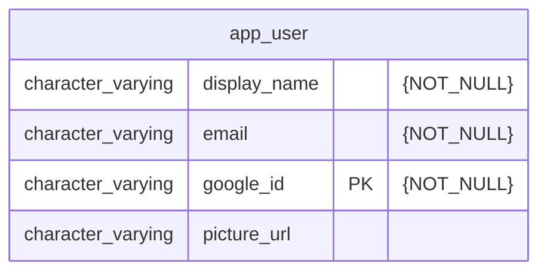

# Sinair LLM Bot

A template for building full-stack web applications with Google OAuth2 authentication.

### Features
- Google OAuth2 login
- Session-based authentication with CSRF protection
- Health check endpoints (liveness & readiness)
- Frontend login page that works independently of backend availability

### Project structure
- Backend — Kotlin Spring Boot 4 application on Maven
- Frontend — TypeScript Next.js with client and server parts
- Deployment — Docker Compose template with backend, frontend, Postgres, and Flyway

### How to run
#### Backend
The project has all its resources stubbed for the most comfortable local development. It has a list of profiles for any running requirements.

| Profile      | Resource | Description                                                              |
|--------------|----------|--------------------------------------------------------------------------|
| stub-google  | Google   | WireMock stubs for Google OAuth2 (no real credentials needed)            |
| prod-google  | Google   | Real Google OAuth2 (requires GOOGLE_CLIENT_ID/SECRET env vars)           |
| h2           | Postgres | H2 in-memory database                                                    |
| postgres     | Postgres | Regular Postgres configuration for a local or remote instance            |
| local        | General  | Common local configurations for development (includes plain-log)         |
| plain-log    | Logging  | Plain text logging (included by local)                                   |

Only one profile from a resource group can be used. For example, the set for the production environment looks like
`postgres,prod-google`, and for local development — `h2,stub-google,local`.

Use IntelliJ to run the backend locally. Add a Run/Debug configuration with Main class `org.taonity.sinairllmbot.MainKt`
and VM options `-Dspring.profiles.active=h2,stub-google,local` and run the backend.

To run it from PS use a command like this:
```bash
mvn -pl backend spring-boot:run '-Dspring-boot.run.jvmArguments="-Dspring.profiles.active=h2,stub-google,local"'
```
h
#### Frontend
I recommend opening /frontend directory in VS Code. Run `npm install`, and then `npm run dev`.

#### Chat Collector
Collects messages from sinair.net chat and stores them in the backend for LLM fine-tuning.

```bash
cd chat-collector
npm install

# With chat-stubs (fake data):
npm run dev:local

# With real sinair.net server (edit .env.prod first):
npm run dev:prod
```

See [chat-collector/README.md](chat-collector/README.md) for full details.

#### Chat Stubs (local only)
A WebSocket mock server for local development. Not deployed to any environment.

```bash
cd chat-stubs
npm install
npm start
```

For Docker local development, use the override file:
```bash
cd templates/docker
docker compose -f docker-compose.yml -f docker-compose.local.yml up
```

### Docker Compose deployment
Docker Compose runs the backend and frontend with Postgres and Flyway migrations.

Run this. These are some shared networks required for production deployment.
```bash
docker network create prodenv-shared-internal
docker network create sinair-llm-bot-shared
```
Run this
```bash
# Prepares Docker Compose templates for running. Make sure you are on the last released tag in git.
mvn clean -P build-automation-docker-compose-project compile -DskipTests=true
# Runs Docker Compose template with images from Dockerhub. Make sure you placed all required env vars.
docker compose -f backend/target/docker/test/docker-compose.yml up -d
```

Or you can build the images yourself by following the instructions. Run this
```bash
# Builds all modules 
mvn clean -P build-docker-image,build-automation-docker-compose-project install -DskipTests=true
# Installs npm modules for Next.js frontend
npm install --prefix frontend/
# Builds the latest image of the frontend app using Dockerfile
docker build -t sinair-llm-bot-frontend frontend/
# Runs Docker Compose template with images from Dockerhub. Make sure you placed all required env vars.
docker compose -f templates/docker/docker-compose.yml up -d
```

### Environment variables
The project requires a set of environment variables to be configured for some services, depending on which profile set you use.

| Env var                              | Service  | Description                                                         |
|--------------------------------------|----------|---------------------------------------------------------------------|
| COMPOSE_PROJECT_NAME                 | Postgres | Name for Docker Compose project                                     |
| POSTGRES_USER                        | Postgres | Used by Flyway                                                      |
| POSTGRES_PASSWORD                    | Postgres | Used by Flyway                                                      |
| POSTGRES_DB                          | Postgres | DB name                                                             |
| POSTGRES_APP_USER                    | Postgres | Used by backend                                                     |
| POSTGRES_APP_PASSWORD                | Postgres | Used by backend                                                     |
| POSTGRES_PORT                        | Postgres |                                                                     |
| POSTGRES_ADDRESS                     | Postgres |                                                                     |
| GOOGLE_CLIENT_ID                     | Backend  | Taken from Google Cloud Console                                     |
| GOOGLE_CLIENT_SECRET                 | Backend  | Taken from Google Cloud Console                                     |
| DEFAULT_SUCCESS_URL                  | Backend  | Redirect for a user after a successful login                        |
| LOGIN_URL                            | Backend  | Redirect for a user after a failed login                            |
| SERVER_SERVLET_SESSION_COOKIE_DOMAIN | Backend  | Base domain for frontend and backend                                |
| SERVER_SERVLET_SESSION_COOKIE_NAME   | Backend  | Cookie name for frontend and backend, for ex. JSESSIONID-STAGE      |
| CSRF_COOKIE_NAME                     | Backend  | CSRF cookie name for frontend and backend, for ex. XSRF-TOKEN-STAGE |
| SPRING_PROFILES_ACTIVE               | Backend  | See the table in [backend](#backend)                                |
| PUBLIC_BACKEND_URL                   | Frontend | Redirect to backend for OAuth initiation                            |
| LOCAL_BACKEND_URL                    | Frontend | Internal backend URL used by frontend server-side requests          |

### PostgreSQL database ERD diagram

<!-- mermerd-start -->

<!-- mermerd-end -->

### Prod deployment
The service is deployed in a cheap VPS. [taonity/docker-webhook](https://github.com/taonity/docker-webhook) is used for
deployment in a custom production environment — [taonity/prodenv](https://github.com/taonity/prodenv/tree/defr-prodenv).

#### GitHub Environment setup
The release workflow uses `environment: production` on the `approve-prod` job to gate production deployments.
For this to require manual approval, you must configure protection rules on the environment:

1. Go to **GitHub repo → Settings → Environments → "production"** (create it if it doesn't exist).
2. Enable **"Required reviewers"** and add the appropriate users or teams.

Without this configuration, the `approve-prod` job will pass automatically with no manual intervention.

### Guides

- [docs/ADD_FEATURE.md](docs/ADD_FEATURE.md) — How to add a new feature (package-per-feature)
- [docs/ADD_EXTERNAL_API.md](docs/ADD_EXTERNAL_API.md) — How to integrate an external API
- [docs/ADD_OAUTH2_PROVIDER.md](docs/ADD_OAUTH2_PROVIDER.md) — How to add/change OAuth2 providers
- [docs/DATABASE.md](docs/DATABASE.md) — Database migrations and schema management
- [docs/TESTING.md](docs/TESTING.md) — Testing patterns and conventions
- [docs/DEPLOYMENT.md](docs/DEPLOYMENT.md) — Docker deployment guide
